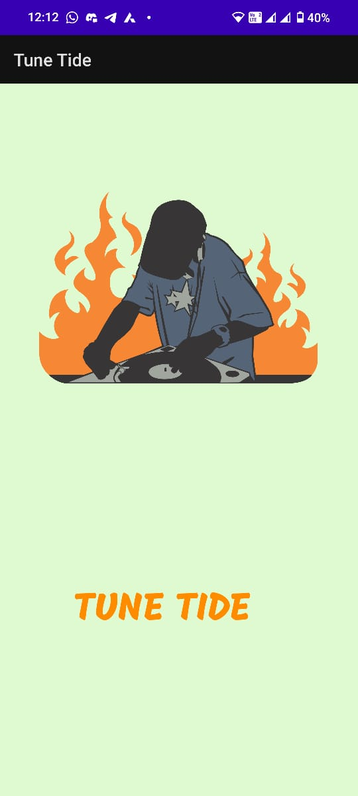
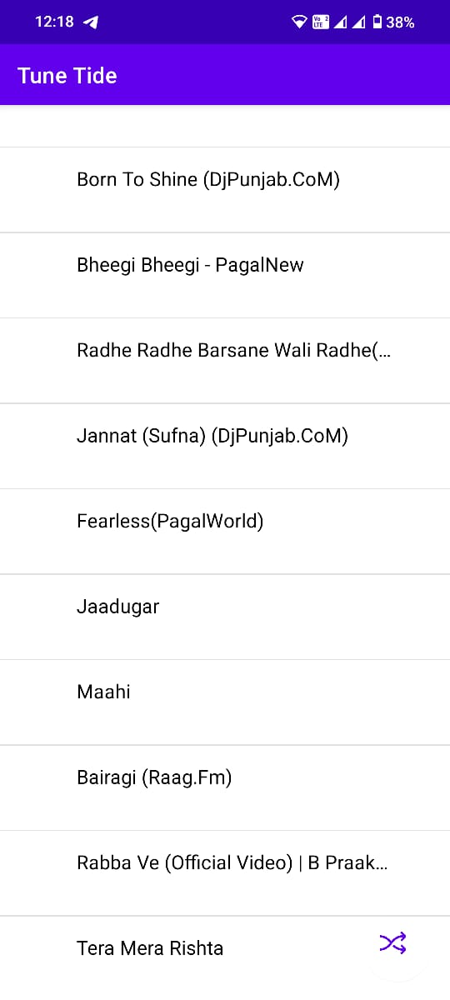
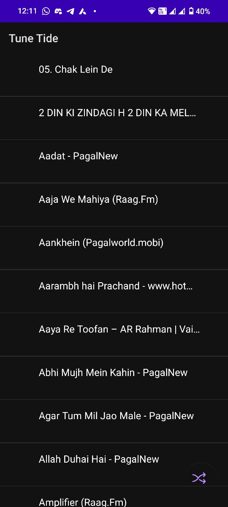
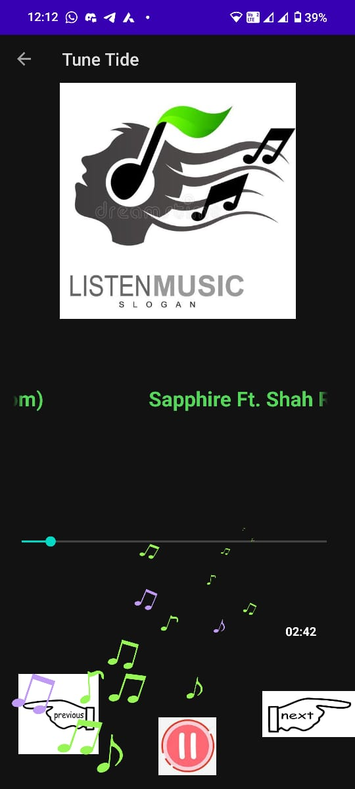
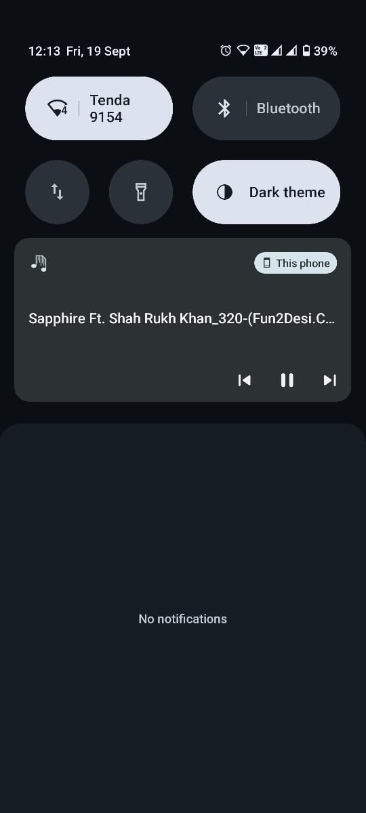

# 🎶 Tune Tide

Tune Tide is a simple, feature-rich **Android music player app** built with Java.  
It automatically scans your device for `.mp3` files and gives you an elegant interface to play, pause, and manage your songs.  

---

## ✨ Features

- 📂 **Local Music Loader** – Scans device storage and lists all `.mp3` files in a clean song list.
- 🎵 **Song Playback Screen** – Play, pause, next, and previous controls with a seek bar.
- 🔔 **Notification Playback Controls** – Music playback controls in the notification shade for quick access.
- ▶️ **Background Playback** – Continue listening when the app is minimized.
- 🔄 **Auto Next Song** – Automatically plays the next song when the current one ends.
- 🔀 **Shuffle Play** – Shuffle your song list with a floating action button.
- 📱 **Call Handling** – Pauses playback on incoming or outgoing calls, and resumes after the call ends.
- 🎚 **Audio Focus Handling** – Properly manages playback when other apps request audio focus.
- ⏸️ **Back Navigation Control** – Playback stops when the user explicitly navigates back from the song player screen.
- 🌙 Dark Mode Support – Full dark/light theme compatibility for a smooth user experience.

---

## 📱 Screenshots

  
  
  
  

  

---

## 🛠️ Tech Stack

- **Language:** Java  
- **Frameworks/Libraries:**  
  - AndroidX  
  - [Dexter](https://github.com/Karumi/Dexter) – runtime permissions  
  - [Lottie](https://airbnb.design/lottie/) – animations  
- **Architecture:** Activity + Service (Foreground music service with `MediaPlayer`)  
- **Minimum SDK:** Android 6.0 (API 23)  

---

## 📂 Project Structure

TuneTide/

    │── MainActivity.java # Loads songs, displays them in a list, shuffle support

    │── PlaySong.java # Song playback screen with seek bar and controls

    │── MusicService.java # Foreground service that handles playback, notification, call events

    │── Song.java # Model class for songs (id, title, uri, thumbnail)
 
│── adapters/

    │ └── ListItemAdapter.java # Custom adapter for song list

│── res/

    │ ├── layout/ # UI XML layouts
  
    │ ├── drawable/ # Icons and assets
  
    │ └── raw/anim.json # Lottie animations

---

## 🚀 Getting Started

### Prerequisites
- Android Studio (latest recommended)
- Minimum Android 6.0 device/emulator
- Required permissions:
  - `READ_EXTERNAL_STORAGE` / `READ_MEDIA_AUDIO` (Android 13+)
  - `POST_NOTIFICATIONS` (Android 13+)
  - `READ_PHONE_STATE`

See [CONTRIBUTING.md](https://github.com/Nishant-Khatri/Tune-Tide-/blob/master/CONTRIBUTING.md) for Contribution Guidelines.
